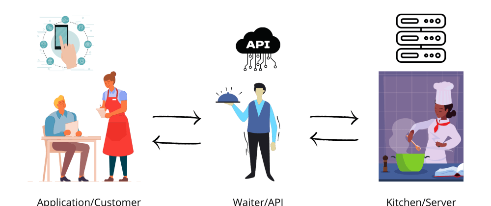
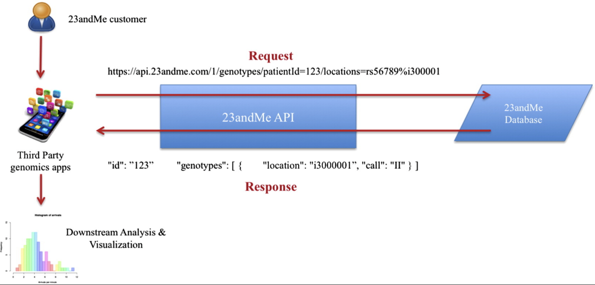

Getting started with API in R
================
Hedia Tnani

# Getting started with API in R

## Why should I learn about APIs?

For the past 2 years, many groups have been working on creating APIs
that the entire research community can leverage. There’s a publication
[A Review on Genomics
APIs](https://www.sciencedirect.com/science/article/pii/S2001037015000471#f0015)
which shows some of the APIs used to retrieve data such as Google
Genomics API and 23andMe API.

## What is an API?

**API** stands for **Application Programming Interface.**

An API acts as interface between two applications (Client and sever).

## How?

Let’s take a non technical example to make it to understand.



[Source](https://dev.to/hackthisfall/what-is-api-explained-in-easy-way-5aih)

In terms of API, we can say that we as **Customer(application)** will
send a **request**, the **waiter(API)** will take our request and send
it to the **chef(server).** The **chef(server)** takes action according
to our request and send it back to the waiter(API). This is how actually
things work in the *backend*.

An example from the 23andMe API.



[Source](https://www.sciencedirect.com/science/article/pii/S2001037015000471#s0020)

## Making API requests in R

To work with APIs in R, we need to bring in two libraries
`httr` and `jsonlite`. 

### 1. Preparing the URL

Every request starts with a URL.

### **What is an URL?**

The **Uniform Resource Locator or URL** is a string (of characters) that
uniquely identifies a web resource. For
example, “https://rest.ensembl.org” is the URL that identifies Ensembl’s
homepage. The URL is the input of any API request. It consists of two
parts: - The fixed part: base URL — the base URL is the main address of
the API web server - The variable part: endpoint — an endpoint is a
server route for retrieving specific data from an API.

### **What is an API endpoint?**

API endpoints are the specific digital location where requests for
information are sent by one program to retrieve the digital resource
that exists there. **Endpoints specify where APIs can access resources
and help guarantee the proper functioning of the incorporated
software**. An API’s performance depends on its capacity to successfully
communicate with API endpoints.

Example:

[Ensembl REST API Endpoints](https://rest.ensembl.org)

Let’s load the `library(httr)`. The `modify_url()` allows us to combine
base URLs and endpoints.

``` r
library(httr)
# Preparing the URL 
baseurl <- "https://rest.ensembl.org"
ext <- "/sequence/id/ENSG00000157764"
url <- modify_url(baseurl, path = ext)
url
```

    [1] "https://rest.ensembl.org/sequence/id/ENSG00000157764"

### 2. Querying the database

APIs use **HTTP verbs** for data requests. One of the most common is a
**GET** request. The GET request asks the API to ***retrieve*** a
resource, such as a database record or the contents of a file, and send
it to the client. To make a GET request we´ll be using the **`GET()`
function** from the `httr` package.

``` r
response = GET(url)
response
```

    Response [https://rest.ensembl.org/sequence/id/ENSG00000157764]
      Date: 2023-02-24 11:44
      Status: 200
      Content-Type: application/json
      Size: 206 kB

The API response contains, among other information, the query URL and
date, the response status, and the content type and size. It might also
include the content itself, but this part isn’t visible here.

The Content-Type of the API response is an `application/json`.

JSON stands for **JavaScript Object Notation.**

Most APIs return data in a JavaScript Object Notation (JSON) format. The
JSON format is beneficial because

1\) it’s a plain text file, and 2) it doesn’t need to be structured in a
tabular data frame (i.e. is can store ‘non-rectangular’ or unstructured
text easily).

### 3. Tracking Errors

When making queries, it’s entirely possible that the output isn’t the
right type or that something will go wrong . Therefore, it’s important
to track these errors. Web servers return status codes every time they
receive an API request. A status code reports what happened with a
request.

Let´s check the status code of our request:

``` r
http_status(response)
```

    $category
    [1] "Success"

    $reason
    [1] "OK"

    $message
    [1] "Success: (200) OK"

The Status-Code element in a server response, is a 3-digit integer where
the first digit of the Status-Code defines the class of response and the
last two digits do not have any categorization role. There are 5 values
for the first digit:

<table>
<colgroup>
<col style="width: 15%" />
<col style="width: 84%" />
</colgroup>
<thead>
<tr class="header">
<th>S.N.</th>
<th>Code and Description</th>
</tr>
</thead>
<tbody>
<tr class="odd">
<td>1</td>
<td><p><strong>1xx: Informational</strong></p>
<p>It means the request has been received and the process is
continuing.</p></td>
</tr>
<tr class="even">
<td>2</td>
<td><p><strong>2xx: Success</strong></p>
<p>It means the action was successfully received, understood, and
accepted.</p></td>
</tr>
<tr class="odd">
<td>3</td>
<td><p><strong>3xx: Redirection</strong></p>
<p>It means further action must be taken in order to complete the
request.</p></td>
</tr>
<tr class="even">
<td>4</td>
<td><p><strong>4xx: Client Error</strong></p>
<p>It means the request contains incorrect syntax or cannot be
fulfilled.</p></td>
</tr>
<tr class="odd">
<td>5</td>
<td><p><strong>5xx: Server Error</strong></p>
<p>It means the server failed to fulfill an apparently valid
request.</p></td>
</tr>
</tbody>
</table>

The `httr` package provides us with several functions to track these
errors.

-   The **`http_error(response)`** checks if something went wrong and
    returns a logical value.

``` r
http_error(response)
```

    [1] FALSE

-   The **`status_code(response)`** returns the status code.

``` r
status_code(response)
```

    [1] 200

-   The **`http_type(response)`** returns the format of the content, so
    we can see if it is what we expected.

``` r
http_type(response)
```

    [1] "application/json"

When something goes wrong and `http_error(response)` returns `TRUE`, we
stop the function execution using the `stop()` function.

``` r
if(http_error(response)){
      status_code(404)
      stop("Something went wrong.")}
```

Another useful function is `stop_for_status(response)` which converts
http errors to R errors or warnings - these should always be used
whenever you’re creating requests inside a function, so that the user
knows why a request has failed. If request was successful, the response
(invisibly). Otherwise, raised a classed http error or warning, as
generated by `http_condition()` . Other helpful functions are
`warn_for_status()` and `message_for_status()`.

### 4. Getting the API response

One very useful function to use is content which **extract content from
a request. For that** we use **`content()`** from the `httr` package to
extract this content.

``` r
library(httr)
# automatically parses JSON
APIResult = content(response)
#APIResult$seq
```

So here we sent an **API request** to the webserver, and it replied with
the sequence(data).

``` r
# add code to extract content here
json_text <- content(response, as="text")
#json_text
```

Let’s add an encoding.

``` r
json_text <-content(response, as = "text", encoding = "UTF-8")
#json_text
```

We can provide the `content_type` in the `GET()`.

### 5. Converting the response into a dataframe

Let’s get all microarrays available for a given species. In R, we can
parse this JSON string and convert it into a DataFrame using the
`fromJSON()` from the `jsonlite` package. If the output of an endpoint
contains a list, R will happily get all items in a list without the need
for any loops.

``` r
library(httr)
library(jsonlite)
library(xml2)
library(tidyverse)
```

    ── Attaching packages ─────────────────────────────────────── tidyverse 1.3.2 ──
    ✔ ggplot2 3.4.0      ✔ purrr   0.3.5 
    ✔ tibble  3.1.8      ✔ dplyr   1.0.10
    ✔ tidyr   1.2.1      ✔ stringr 1.4.1 
    ✔ readr   2.1.3      ✔ forcats 0.5.2 
    ── Conflicts ────────────────────────────────────────── tidyverse_conflicts() ──
    ✖ dplyr::filter()  masks stats::filter()
    ✖ purrr::flatten() masks jsonlite::flatten()
    ✖ dplyr::lag()     masks stats::lag()

``` r
baseURL <- "https://rest.ensembl.org"
ext <- "/regulatory/species/homo_sapiens/microarray?"
 
r <- GET(paste(baseURL, ext, sep = ""), content_type("application/json"))
 
stop_for_status(r)
class(content(r)) # list
```

    [1] "list"

``` r
#fromJSON(content(r, "text", encoding = "UTF-8"))
#content(r, "text", encoding = "UTF-8")
```

We can add the desired type of output: **`raw`**, **`text`** or
**`parsed`**. **`content`** attempts to automatically figure out which
one is most appropriate, based on the content-type.

``` r
identical(content(r,"parsed"), content(r))
```

    [1] TRUE

The `fromJSON` needs as an argument a JSON string, URL or file. To make
it a JSON string we convert it to text.

``` r
content(r, "text", encoding = "UTF-8")
```

    [1] "[{\"description\":null,\"array\":\"OneArray\",\"format\":\"EXPRESSION\",\"type\":\"OLIGO\",\"vendor\":\"PHALANX\"},{\"format\":\"EXPRESSION\",\"description\":null,\"array\":\"CODELINK\",\"vendor\":\"CODELINK\",\"type\":\"OLIGO\"},{\"format\":\"EXPRESSION\",\"array\":\"HumanWG_6_V3\",\"description\":null,\"vendor\":\"ILLUMINA\",\"type\":\"OLIGO\"},{\"description\":null,\"array\":\"GPL6848\",\"format\":\"EXPRESSION\",\"type\":\"OLIGO\",\"vendor\":\"AGILENT\"},{\"type\":\"OLIGO\",\"vendor\":\"ILLUMINA\",\"array\":\"HumanMethylation450\",\"description\":null,\"format\":\"METHYLATION\"},{\"type\":\"OLIGO\",\"vendor\":\"ILLUMINA\",\"format\":\"EXPRESSION\",\"array\":\"HumanRef-8_V3\",\"description\":null},{\"type\":\"OLIGO\",\"vendor\":\"AGILENT\",\"format\":\"EXPRESSION\",\"description\":null,\"array\":\"WholeGenome\"},{\"vendor\":\"AGILENT\",\"type\":\"OLIGO\",\"array\":\"CGH_44b\",\"description\":null,\"format\":\"CGH\"},{\"format\":\"EXPRESSION\",\"array\":\"SurePrint_G3_GE_8x60k\",\"description\":null,\"type\":\"OLIGO\",\"vendor\":\"AGILENT\"},{\"format\":\"EXPRESSION\",\"description\":null,\"array\":\"HC-G110\",\"vendor\":\"AFFY\",\"type\":\"OLIGO\"},{\"array\":\"SurePrint_G3_GE_8x60k_v2\",\"description\":null,\"format\":\"EXPRESSION\",\"vendor\":\"AGILENT\",\"type\":\"OLIGO\"},{\"format\":\"EXPRESSION\",\"array\":\"HG-Focus\",\"description\":null,\"type\":\"OLIGO\",\"vendor\":\"AFFY\"},{\"description\":null,\"array\":\"WholeGenome_4x44k_v1\",\"format\":\"EXPRESSION\",\"type\":\"OLIGO\",\"vendor\":\"AGILENT\"},{\"description\":null,\"array\":\"WholeGenome_4x44k_v2\",\"format\":\"EXPRESSION\",\"type\":\"OLIGO\",\"vendor\":\"AGILENT\"},{\"format\":\"EXPRESSION\",\"description\":null,\"array\":\"GPL26966\",\"type\":\"OLIGO\",\"vendor\":\"AGILENT\"},{\"type\":\"OLIGO\",\"vendor\":\"AFFY\",\"format\":\"EXPRESSION\",\"array\":\"HG-U133A_2\",\"description\":null},{\"vendor\":\"AGILENT\",\"type\":\"OLIGO\",\"format\":\"EXPRESSION\",\"description\":null,\"array\":\"GPL19072\"},{\"type\":\"OLIGO\",\"vendor\":\"ILLUMINA\",\"format\":\"METHYLATION\",\"description\":null,\"array\":\"HumanMethylation27\"},{\"description\":null,\"array\":\"HG-U133B\",\"format\":\"EXPRESSION\",\"vendor\":\"AFFY\",\"type\":\"OLIGO\"},{\"format\":\"EXPRESSION\",\"description\":\"Human Transcriptome Array 2.0\",\"array\":\"HTA-2_0\",\"type\":\"OLIGO\",\"vendor\":\"AFFY\"},{\"array\":\"HG-U133_Plus_2\",\"description\":null,\"format\":\"EXPRESSION\",\"vendor\":\"AFFY\",\"type\":\"OLIGO\"},{\"format\":\"EXPRESSION\",\"array\":\"HG_U95Av2\",\"description\":null,\"type\":\"OLIGO\",\"vendor\":\"AFFY\"},{\"format\":\"EXPRESSION\",\"array\":\"HG-U95B\",\"description\":null,\"type\":\"OLIGO\",\"vendor\":\"AFFY\"},{\"format\":\"EXPRESSION\",\"array\":\"HG-U95C\",\"description\":null,\"vendor\":\"AFFY\",\"type\":\"OLIGO\"},{\"description\":null,\"array\":\"HG-U95D\",\"format\":\"EXPRESSION\",\"type\":\"OLIGO\",\"vendor\":\"AFFY\"},{\"array\":\"HG-U95E\",\"description\":null,\"format\":\"EXPRESSION\",\"vendor\":\"AFFY\",\"type\":\"OLIGO\"},{\"type\":\"OLIGO\",\"vendor\":\"AFFY\",\"format\":\"EXPRESSION\",\"array\":\"HG_U95A\",\"description\":null},{\"vendor\":\"AFFY\",\"type\":\"OLIGO\",\"format\":\"EXPRESSION\",\"array\":\"HuGeneFL\",\"description\":null},{\"format\":\"EXPRESSION\",\"array\":\"U133_X3P\",\"description\":null,\"vendor\":\"AFFY\",\"type\":\"OLIGO\"},{\"format\":\"EXPRESSION\",\"description\":null,\"array\":\"PrimeView\",\"vendor\":\"AFFY\",\"type\":\"OLIGO\"},{\"vendor\":\"AFFY\",\"type\":\"OLIGO\",\"format\":\"EXPRESSION\",\"array\":\"HT_HG-U133_Plus_PM\",\"description\":null},{\"type\":\"OLIGO\",\"vendor\":\"AFFY\",\"format\":\"EXPRESSION\",\"array\":\"HuEx-1_0-st-v2\",\"description\":null},{\"type\":\"OLIGO\",\"vendor\":\"AFFY\",\"format\":\"EXPRESSION\",\"description\":null,\"array\":\"HuGene-2_0-st-v1\"},{\"vendor\":\"AFFY\",\"type\":\"OLIGO\",\"format\":\"EXPRESSION\",\"description\":null,\"array\":\"HuGene-1_0-st-v1\"},{\"vendor\":\"AFFY\",\"type\":\"OLIGO\",\"array\":\"HuGene-2_1-st-v1\",\"description\":null,\"format\":\"EXPRESSION\"}]"

To convert it to a dataframe we use the `fromJSON` function.

``` r
fromJSON(content(r, "text", encoding = "UTF-8"))
```

                         description                    array      format  type
    1                           <NA>                 OneArray  EXPRESSION OLIGO
    2                           <NA>                 CODELINK  EXPRESSION OLIGO
    3                           <NA>             HumanWG_6_V3  EXPRESSION OLIGO
    4                           <NA>                  GPL6848  EXPRESSION OLIGO
    5                           <NA>      HumanMethylation450 METHYLATION OLIGO
    6                           <NA>            HumanRef-8_V3  EXPRESSION OLIGO
    7                           <NA>              WholeGenome  EXPRESSION OLIGO
    8                           <NA>                  CGH_44b         CGH OLIGO
    9                           <NA>    SurePrint_G3_GE_8x60k  EXPRESSION OLIGO
    10                          <NA>                  HC-G110  EXPRESSION OLIGO
    11                          <NA> SurePrint_G3_GE_8x60k_v2  EXPRESSION OLIGO
    12                          <NA>                 HG-Focus  EXPRESSION OLIGO
    13                          <NA>     WholeGenome_4x44k_v1  EXPRESSION OLIGO
    14                          <NA>     WholeGenome_4x44k_v2  EXPRESSION OLIGO
    15                          <NA>                 GPL26966  EXPRESSION OLIGO
    16                          <NA>               HG-U133A_2  EXPRESSION OLIGO
    17                          <NA>                 GPL19072  EXPRESSION OLIGO
    18                          <NA>       HumanMethylation27 METHYLATION OLIGO
    19                          <NA>                 HG-U133B  EXPRESSION OLIGO
    20 Human Transcriptome Array 2.0                  HTA-2_0  EXPRESSION OLIGO
    21                          <NA>           HG-U133_Plus_2  EXPRESSION OLIGO
    22                          <NA>                HG_U95Av2  EXPRESSION OLIGO
    23                          <NA>                  HG-U95B  EXPRESSION OLIGO
    24                          <NA>                  HG-U95C  EXPRESSION OLIGO
    25                          <NA>                  HG-U95D  EXPRESSION OLIGO
    26                          <NA>                  HG-U95E  EXPRESSION OLIGO
    27                          <NA>                  HG_U95A  EXPRESSION OLIGO
    28                          <NA>                 HuGeneFL  EXPRESSION OLIGO
    29                          <NA>                 U133_X3P  EXPRESSION OLIGO
    30                          <NA>                PrimeView  EXPRESSION OLIGO
    31                          <NA>       HT_HG-U133_Plus_PM  EXPRESSION OLIGO
    32                          <NA>           HuEx-1_0-st-v2  EXPRESSION OLIGO
    33                          <NA>         HuGene-2_0-st-v1  EXPRESSION OLIGO
    34                          <NA>         HuGene-1_0-st-v1  EXPRESSION OLIGO
    35                          <NA>         HuGene-2_1-st-v1  EXPRESSION OLIGO
         vendor
    1   PHALANX
    2  CODELINK
    3  ILLUMINA
    4   AGILENT
    5  ILLUMINA
    6  ILLUMINA
    7   AGILENT
    8   AGILENT
    9   AGILENT
    10     AFFY
    11  AGILENT
    12     AFFY
    13  AGILENT
    14  AGILENT
    15  AGILENT
    16     AFFY
    17  AGILENT
    18 ILLUMINA
    19     AFFY
    20     AFFY
    21     AFFY
    22     AFFY
    23     AFFY
    24     AFFY
    25     AFFY
    26     AFFY
    27     AFFY
    28     AFFY
    29     AFFY
    30     AFFY
    31     AFFY
    32     AFFY
    33     AFFY
    34     AFFY
    35     AFFY

Let´s convert it to a tibble

``` r
as_tibble(fromJSON(content(r, "text", encoding = "UTF-8")))
```

    # A tibble: 35 × 5
       description array                 format      type  vendor  
       <chr>       <chr>                 <chr>       <chr> <chr>   
     1 <NA>        OneArray              EXPRESSION  OLIGO PHALANX 
     2 <NA>        CODELINK              EXPRESSION  OLIGO CODELINK
     3 <NA>        HumanWG_6_V3          EXPRESSION  OLIGO ILLUMINA
     4 <NA>        GPL6848               EXPRESSION  OLIGO AGILENT 
     5 <NA>        HumanMethylation450   METHYLATION OLIGO ILLUMINA
     6 <NA>        HumanRef-8_V3         EXPRESSION  OLIGO ILLUMINA
     7 <NA>        WholeGenome           EXPRESSION  OLIGO AGILENT 
     8 <NA>        CGH_44b               CGH         OLIGO AGILENT 
     9 <NA>        SurePrint_G3_GE_8x60k EXPRESSION  OLIGO AGILENT 
    10 <NA>        HC-G110               EXPRESSION  OLIGO AFFY    
    # … with 25 more rows

### 6. Making a function

Let´s make a function.

``` r
library(httr)
library(jsonlite)

get_microarrays <- function(baseURL, ext, content_type){

    r <- GET(paste(baseURL, ext, sep = ""), accept(content_type))

    stop_for_status(r)

    if (content_type == 'application/json'){
        return (fromJSON(content(r, "text", encoding = "UTF-8")))
    } else {
        return (content(r, "text", encoding = "UTF-8"))
    }
}

baseURL <- "https://rest.ensembl.org"
ext <- "/regulatory/species/homo_sapiens/microarray?"
con <- "application/json"


get_microarrays(baseURL, ext, con)
```

        type   vendor      format                    array
    1  OLIGO  PHALANX  EXPRESSION                 OneArray
    2  OLIGO CODELINK  EXPRESSION                 CODELINK
    3  OLIGO ILLUMINA  EXPRESSION             HumanWG_6_V3
    4  OLIGO  AGILENT  EXPRESSION                  GPL6848
    5  OLIGO ILLUMINA METHYLATION      HumanMethylation450
    6  OLIGO ILLUMINA  EXPRESSION            HumanRef-8_V3
    7  OLIGO  AGILENT  EXPRESSION              WholeGenome
    8  OLIGO  AGILENT         CGH                  CGH_44b
    9  OLIGO  AGILENT  EXPRESSION    SurePrint_G3_GE_8x60k
    10 OLIGO     AFFY  EXPRESSION                  HC-G110
    11 OLIGO  AGILENT  EXPRESSION SurePrint_G3_GE_8x60k_v2
    12 OLIGO     AFFY  EXPRESSION                 HG-Focus
    13 OLIGO  AGILENT  EXPRESSION     WholeGenome_4x44k_v1
    14 OLIGO  AGILENT  EXPRESSION     WholeGenome_4x44k_v2
    15 OLIGO  AGILENT  EXPRESSION                 GPL26966
    16 OLIGO     AFFY  EXPRESSION               HG-U133A_2
    17 OLIGO  AGILENT  EXPRESSION                 GPL19072
    18 OLIGO ILLUMINA METHYLATION       HumanMethylation27
    19 OLIGO     AFFY  EXPRESSION                 HG-U133B
    20 OLIGO     AFFY  EXPRESSION                  HTA-2_0
    21 OLIGO     AFFY  EXPRESSION           HG-U133_Plus_2
    22 OLIGO     AFFY  EXPRESSION                HG_U95Av2
    23 OLIGO     AFFY  EXPRESSION                  HG-U95B
    24 OLIGO     AFFY  EXPRESSION                  HG-U95C
    25 OLIGO     AFFY  EXPRESSION                  HG-U95D
    26 OLIGO     AFFY  EXPRESSION                  HG-U95E
    27 OLIGO     AFFY  EXPRESSION                  HG_U95A
    28 OLIGO     AFFY  EXPRESSION                 HuGeneFL
    29 OLIGO     AFFY  EXPRESSION                 U133_X3P
    30 OLIGO     AFFY  EXPRESSION                PrimeView
    31 OLIGO     AFFY  EXPRESSION       HT_HG-U133_Plus_PM
    32 OLIGO     AFFY  EXPRESSION           HuEx-1_0-st-v2
    33 OLIGO     AFFY  EXPRESSION         HuGene-2_0-st-v1
    34 OLIGO     AFFY  EXPRESSION         HuGene-1_0-st-v1
    35 OLIGO     AFFY  EXPRESSION         HuGene-2_1-st-v1
                         description
    1                           <NA>
    2                           <NA>
    3                           <NA>
    4                           <NA>
    5                           <NA>
    6                           <NA>
    7                           <NA>
    8                           <NA>
    9                           <NA>
    10                          <NA>
    11                          <NA>
    12                          <NA>
    13                          <NA>
    14                          <NA>
    15                          <NA>
    16                          <NA>
    17                          <NA>
    18                          <NA>
    19                          <NA>
    20 Human Transcriptome Array 2.0
    21                          <NA>
    22                          <NA>
    23                          <NA>
    24                          <NA>
    25                          <NA>
    26                          <NA>
    27                          <NA>
    28                          <NA>
    29                          <NA>
    30                          <NA>
    31                          <NA>
    32                          <NA>
    33                          <NA>
    34                          <NA>
    35                          <NA>

Let’s get the mouse homologue of the human BRCA2. If you specify another
content type (not json), the helper function will get you this as text.

``` r
gene <- "BRCA2"

# define the URL parameters
server <- "http://rest.ensembl.org/"
con <- "application/json"
request <- paste("homology/symbol/human/", gene, "?target_species=mouse", sep = "")
r <- GET(paste(server, request, sep = ""), accept(con))
stop_for_status(r)
result = fromJSON(content(r, "text", encoding = "UTF-8"))
result$data$id
```

    [1] "ENSG00000139618"

Let’s retrieve the Kegg database using the Kegg API.

#### Kegg API using R

``` r
library(httr)
library(jsonlite)
library(xml2)
 
server <- "https://rest.kegg.jp"
ext <- "/info/hsa"
 
r <- GET(paste(server, ext, sep = ""), content_type("application/json"))
 
content(r)
```

    [1] "T01001           Homo sapiens (human) KEGG Genes Database\nhsa              Release 105.0+/02-24, Feb 23\n                 Kanehisa Laboratories\n                 24,729 entries\n\nlinked db        pathway\n                 brite\n                 module\n                 ko\n                 genome\n                 enzyme\n                 network\n                 disease\n                 drug\n                 ncbi-geneid\n                 ncbi-proteinid\n                 uniprot\n"

Let’s have a look at the list of human pathways in Kegg.

``` r
library(httr)
library(jsonlite)
library(xml2)
library(tidyverse)

server <- "https://rest.kegg.jp"
ext <- "/list/pathway/hsa"
 
r <- GET(paste(server, ext, sep = ""), content_type("application/json"))
 
txt <- content(r, "text")
df <- tibble(kegg_results = read_lines(txt))
```

``` r
df %>% separate(., col=kegg_results, into=c('Pathway_number', 'Pathway_name'), sep='\t')
```

    # A tibble: 352 × 2
       Pathway_number Pathway_name                                                  
       <chr>          <chr>                                                         
     1 path:hsa00010  Glycolysis / Gluconeogenesis - Homo sapiens (human)           
     2 path:hsa00020  Citrate cycle (TCA cycle) - Homo sapiens (human)              
     3 path:hsa00030  Pentose phosphate pathway - Homo sapiens (human)              
     4 path:hsa00040  Pentose and glucuronate interconversions - Homo sapiens (huma…
     5 path:hsa00051  Fructose and mannose metabolism - Homo sapiens (human)        
     6 path:hsa00052  Galactose metabolism - Homo sapiens (human)                   
     7 path:hsa00053  Ascorbate and aldarate metabolism - Homo sapiens (human)      
     8 path:hsa00061  Fatty acid biosynthesis - Homo sapiens (human)                
     9 path:hsa00062  Fatty acid elongation - Homo sapiens (human)                  
    10 path:hsa00071  Fatty acid degradation - Homo sapiens (human)                 
    # … with 342 more rows

Let’s retrieve the amino acid sequence of a human gene in a `fasta`
format.

``` r
server <- "https://rest.kegg.jp"
ext <- "/get/hsa:10458/aaseq"
 
r <- GET(paste(server, ext, sep = ""), content_type("text/x-fasta"))

print(content(r))
```

    [1] ">hsa:10458 K05627 BAI1-associated protein 2 | (RefSeq) BAIAP2, BAP2, FLAF3, IRSP53, WAML; BAR/IMD domain containing adaptor protein 2 (A)\nMSLSRSEEMHRLTENVYKTIMEQFNPSLRNFIAMGKNYEKALAGVTYAAKGYFDALVKMG\nELASESQGSKELGDVLFQMAEVHRQIQNQLEEMLKSFHNELLTQLEQKVELDSRYLSAAL\nKKYQTEQRSKGDALDKCQAELKKLRKKSQGSKNPQKYSDKELQYIDAISNKQGELENYVS\nDGYKTALTEERRRFCFLVEKQCAVAKNSAAYHSKGKELLAQKLPLWQQACADPSKIPERA\nVQLMQQVASNGATLPSALSASKSNLVISDPIPGAKPLPVPPELAPFVGRMSAQESTPIMN\nGVTGPDGEDYSPWADRKAAQPKSLSPPQSQSKLSDSYSNTLPVRKSVTPKNSYATTENKT\nLPRSSSMAAGLERNGRMRVKAIFSHAAGDNSTLLSFKEGDLITLLVPEARDGWHYGESEK\nTKMRGWFPFSYTRVLDSDGSDRLHMSLQQGKSSSTGNLLDKDDLAIPPPDYGAASRAFPA\nQTASGFKQRPYSVAVPAFSQGLDDYGARSMSRNPFAHVQLKPTVTNDRCDLSAQGPEGRE\nHGDGSARTLAGR\n"

Let’s try the `xml` content_type.

``` r
server <- "https://rest.kegg.jp"
ext <- "/get/hsa00600/kgml"
 
r <- GET(paste(server, ext, sep = ""), content_type("text/xml"))

content(r,encoding = "UTF-8")
```

    {xml_document}
    <pathway name="path:hsa00600" org="hsa" number="00600" title="Sphingolipid metabolism" image="https://www.kegg.jp/kegg/pathway/hsa/hsa00600.png" link="https://www.kegg.jp/kegg-bin/show_pathway?hsa00600">
     [1] <entry id="128" name="hsa:5660 hsa:768239" type="gene" link="https://www ...
     [2] <entry id="35" name="hsa:55331" type="gene" reaction="rn:R06518" link="h ...
     [3] <entry id="36" name="ko:K05848" type="ortholog" reaction="rn:R06528" lin ...
     [4] <entry id="38" name="hsa:130367 hsa:81537" type="gene" reaction="rn:R065 ...
     [5] <entry id="39" name="hsa:130367 hsa:81537" type="gene" reaction="rn:R065 ...
     [6] <entry id="40" name="hsa:130367 hsa:81537" type="gene" reaction="rn:R065 ...
     [7] <entry id="41" name="hsa:427 hsa:56624" type="gene" reaction="rn:R06518" ...
     [8] <entry id="42" name="hsa:427 hsa:56624" type="gene" reaction="rn:R06528" ...
     [9] <entry id="43" name="hsa:10715 hsa:204219 hsa:253782 hsa:29956 hsa:79603 ...
    [10] <entry id="44" name="hsa:123099 hsa:8560" type="gene" reaction="rn:R0651 ...
    [11] <entry id="45" name="ko:K04709" type="ortholog" reaction="rn:R06527" lin ...
    [12] <entry id="46" name="hsa:123099 hsa:8560" type="gene" reaction="rn:R0652 ...
    [13] <entry id="47" name="hsa:123099 hsa:8560" type="gene" reaction="rn:R0652 ...
    [14] <entry id="48" name="hsa:339221 hsa:55512 hsa:55627 hsa:6609 hsa:6610" t ...
    [15] <entry id="49" name="hsa:10715 hsa:204219 hsa:253782 hsa:29956 hsa:79603 ...
    [16] <entry id="51" name="ko:K26283" type="ortholog" reaction="rn:R01503" lin ...
    [17] <entry id="52" name="ko:K01123" type="ortholog" reaction="rn:R02542" lin ...
    [18] <entry id="53" name="hsa:64781" type="gene" reaction="rn:R01495" link="h ...
    [19] <entry id="54" name="hsa:8611 hsa:8612 hsa:8613" type="gene" reaction="r ...
    [20] <entry id="55" name="hsa:8611 hsa:8612 hsa:8613" type="gene" reaction="r ...
    ...

## API using httr2

### **1. Create a request**

Let´s have a look at the [23andme](https://api.23andme.com/docs) API.
Let’s get the list of accessions available on 23andMe platforms.

``` r
library(httr2)
```


    Attaching package: 'httr2'

    The following object is masked from 'package:xml2':

        url_parse

``` r
req <- request("https://api.23andme.com/3/accession/")
req
```

    <httr2_request>

    GET https://api.23andme.com/3/accession/

    Body: empty

We can see exactly what this request will send to the server with a dry
run:

``` r
req %>% req_dry_run()
```

    GET /3/accession/ HTTP/1.1
    Host: api.23andme.com
    User-Agent: httr2/0.2.2 r-curl/4.3.3 libcurl/7.86.0
    Accept: */*
    Accept-Encoding: deflate, gzip

What's changed with `httr`?

-   The method has changed from GET to POST. POST is the standard method
    for sending data to a website, and is automatically used whenever
    you add a body. Use `req_method()` to for a different method.

-   There are two new headers: `Content-Type` and `Content-Length`. They
    tell the server how to interpret the body — it's encoded as JSON and
    is 15 bytes long.

-   We have a body, consisting of some JSON.

### **2. Perform a request and fetch the response**

To actually perform a request and fetch the response back from the
server, call `req_perform()`

``` r
resp <- req %>% req_perform()
resp
```

    <httr2_response>

    GET https://api.23andme.com/3/accession/

    Status: 200 OK

    Content-Type: application/json

    Body: In memory (1474 bytes)

### 3. Tracking Errors

Responses with status codes 4xx and 5xx are HTTP errors. httr2
automatically turns these into R errors. This is another important
difference to httr, which required that you explicitly call
`httr::stop_for_status()` to turn HTTP errors into R errors.

### 4. Getting the API response

You can extract the body in various forms using the `resp_body_*()`
family of functions. Since this response returns JSON we can use
`resp_body_json()`:

``` r
resp %>% resp_body_json()  
```

    $data
    $data[[1]]
    $data[[1]]$id
    [1] "NC_000001.10"

    $data[[1]]$chromosome
    [1] "1"

    $data[[1]]$length
    [1] 249250621


    $data[[2]]
    $data[[2]]$id
    [1] "NC_000002.11"

    $data[[2]]$chromosome
    [1] "2"

    $data[[2]]$length
    [1] 243199373


    $data[[3]]
    $data[[3]]$id
    [1] "NC_000003.11"

    $data[[3]]$chromosome
    [1] "3"

    $data[[3]]$length
    [1] 198022430


    $data[[4]]
    $data[[4]]$id
    [1] "NC_000004.11"

    $data[[4]]$chromosome
    [1] "4"

    $data[[4]]$length
    [1] 191154276


    $data[[5]]
    $data[[5]]$id
    [1] "NC_000005.9"

    $data[[5]]$chromosome
    [1] "5"

    $data[[5]]$length
    [1] 180915260


    $data[[6]]
    $data[[6]]$id
    [1] "NC_000006.11"

    $data[[6]]$chromosome
    [1] "6"

    $data[[6]]$length
    [1] 171115067


    $data[[7]]
    $data[[7]]$id
    [1] "NC_000007.13"

    $data[[7]]$chromosome
    [1] "7"

    $data[[7]]$length
    [1] 159138663


    $data[[8]]
    $data[[8]]$id
    [1] "NC_000008.10"

    $data[[8]]$chromosome
    [1] "8"

    $data[[8]]$length
    [1] 146364022


    $data[[9]]
    $data[[9]]$id
    [1] "NC_000009.11"

    $data[[9]]$chromosome
    [1] "9"

    $data[[9]]$length
    [1] 141213431


    $data[[10]]
    $data[[10]]$id
    [1] "NC_000010.10"

    $data[[10]]$chromosome
    [1] "10"

    $data[[10]]$length
    [1] 135534747


    $data[[11]]
    $data[[11]]$id
    [1] "NC_000011.9"

    $data[[11]]$chromosome
    [1] "11"

    $data[[11]]$length
    [1] 135006516


    $data[[12]]
    $data[[12]]$id
    [1] "NC_000012.11"

    $data[[12]]$chromosome
    [1] "12"

    $data[[12]]$length
    [1] 133851895


    $data[[13]]
    $data[[13]]$id
    [1] "NC_000013.10"

    $data[[13]]$chromosome
    [1] "13"

    $data[[13]]$length
    [1] 115169878


    $data[[14]]
    $data[[14]]$id
    [1] "NC_000014.8"

    $data[[14]]$chromosome
    [1] "14"

    $data[[14]]$length
    [1] 107349540


    $data[[15]]
    $data[[15]]$id
    [1] "NC_000015.9"

    $data[[15]]$chromosome
    [1] "15"

    $data[[15]]$length
    [1] 102531392


    $data[[16]]
    $data[[16]]$id
    [1] "NC_000016.9"

    $data[[16]]$chromosome
    [1] "16"

    $data[[16]]$length
    [1] 90354753


    $data[[17]]
    $data[[17]]$id
    [1] "NC_000017.10"

    $data[[17]]$chromosome
    [1] "17"

    $data[[17]]$length
    [1] 81195210


    $data[[18]]
    $data[[18]]$id
    [1] "NC_000018.9"

    $data[[18]]$chromosome
    [1] "18"

    $data[[18]]$length
    [1] 78077248


    $data[[19]]
    $data[[19]]$id
    [1] "NC_000019.9"

    $data[[19]]$chromosome
    [1] "19"

    $data[[19]]$length
    [1] 59128983


    $data[[20]]
    $data[[20]]$id
    [1] "NC_000020.10"

    $data[[20]]$chromosome
    [1] "20"

    $data[[20]]$length
    [1] 63025520


    $data[[21]]
    $data[[21]]$id
    [1] "NC_000021.8"

    $data[[21]]$chromosome
    [1] "21"

    $data[[21]]$length
    [1] 48129895


    $data[[22]]
    $data[[22]]$id
    [1] "NC_000022.10"

    $data[[22]]$chromosome
    [1] "22"

    $data[[22]]$length
    [1] 51304566


    $data[[23]]
    $data[[23]]$id
    [1] "NC_000023.10"

    $data[[23]]$chromosome
    [1] "X"

    $data[[23]]$length
    [1] 155270560


    $data[[24]]
    $data[[24]]$id
    [1] "NC_000024.9"

    $data[[24]]$chromosome
    [1] "Y"

    $data[[24]]$length
    [1] 59373566


    $data[[25]]
    $data[[25]]$id
    [1] "NC_012920.1"

    $data[[25]]$chromosome
    [1] "MT"

    $data[[25]]$length
    [1] 16569


    $links
    $links$`next`
    NULL

## Convert curl commands to R

[scrapingbee](https://www.scrapingbee.com/curl-converter/r/)

[curlconverter](https://curlconverter.com/r/)

## References

https://www.w3schools.com/js/js_json_intro.asp

https://www.tutorialspoint.com/http/http_status_codes.htm

https://medium.com/geekculture/a-beginners-guide-to-apis-9aa7b1b2e172

https://httr2.r-lib.org/articles/httr2.html

https://httr2.r-lib.org/articles/wrapping-apis.html#faker-api

https://www.storybench.org/how-to-access-apis-in-r/

https://www.scrapingbee.com/curl-converter/r/

https://curlconverter.com/r/
